<h1 align="center">
     
    
🚀 Projeto LabeX 

</h1>

 

☄️ O projeto hoje será integrado com API labefy onde podemos fazer uma playlist, adicionar musicas, listar as músicas e ouvi-las. 

<h1>
     
    
🔗 Link do projeto no Surge

</h1>

https://satisfying-rail.surge.sh/

<h1>
     
    
🔐 Informações para Login

</h1>

📧 Email: elisabete@gmail.com.br
 
🔑 Senha: 1234567

 

<h1>
     
    
🧠 Contexto

</h1>

O objetivo foi criar um aplicativo para mostar novas mensagens.

- Como rodar o projeto
- Layout
- Tecnologias Utilizadas
- Bibliotecas Utilizadas
- Requisitos
- O que esta funcionando
- O que não está funcionando
- Saudações da Eli!

 

# 💻 Como rodar o projeto localmente

Siga os passos e inclua as informações abaixo:

| Passo                     | Comando/informação |
| ------------------------- | ------------------ |
| Faça o fork               | `botão de forkar`  |
| ou Faça o clone           | `git clone`        |
| Instale as dependências   | `npm i`            |
| utilize o script de start | `npm start`        |

 

<h1>
     
    
🎨 Layout

</h1>

## 🖥️ web

     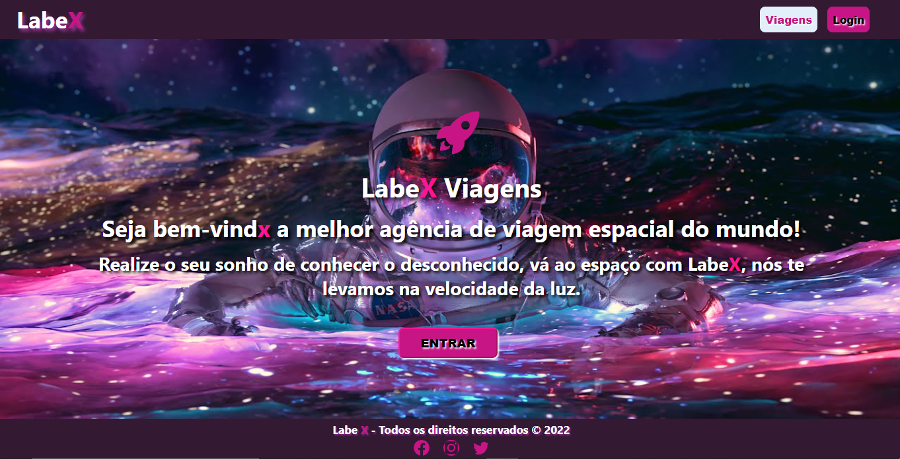   
     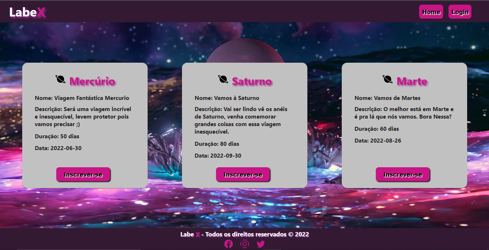

     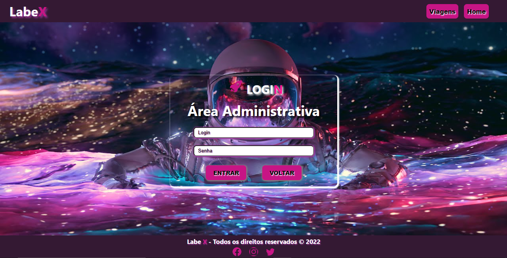
     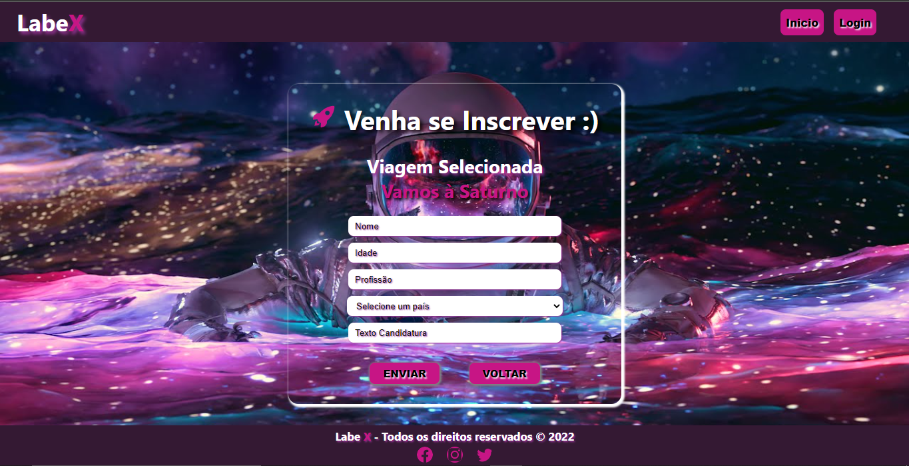
     

     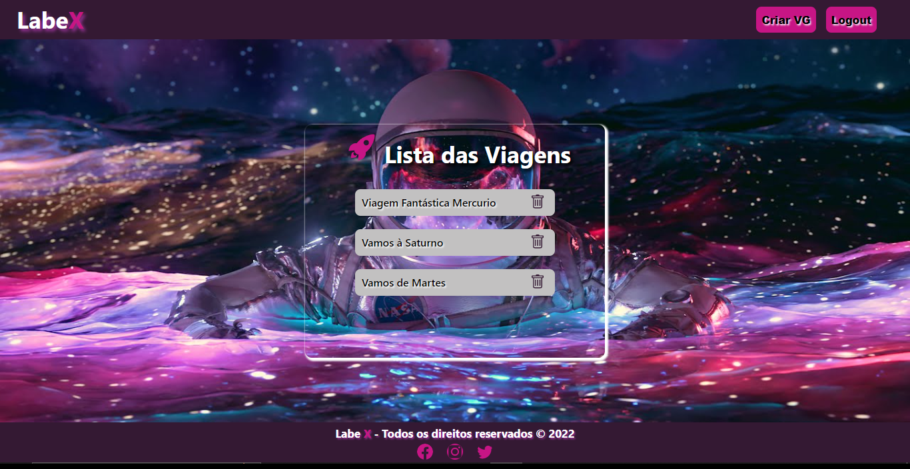
     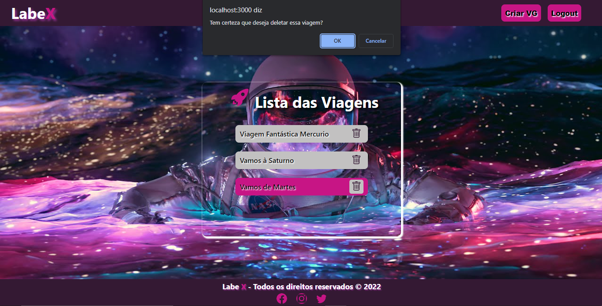 

     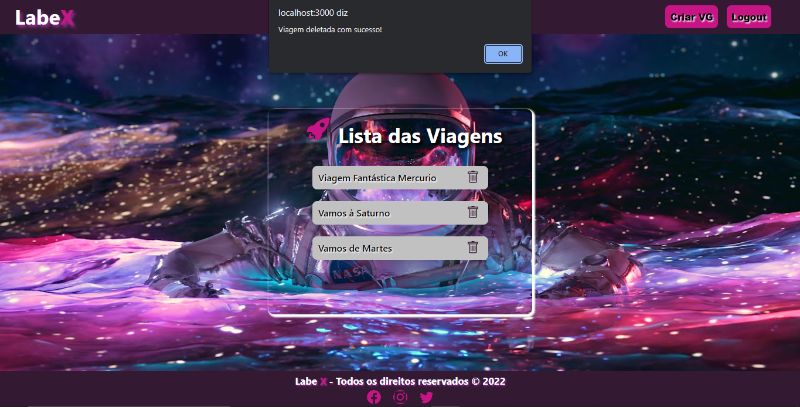   
     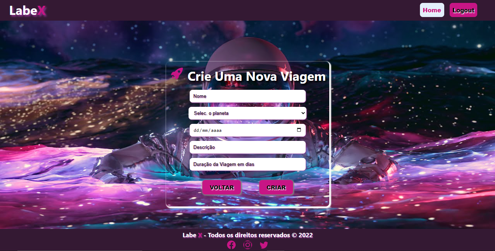   

     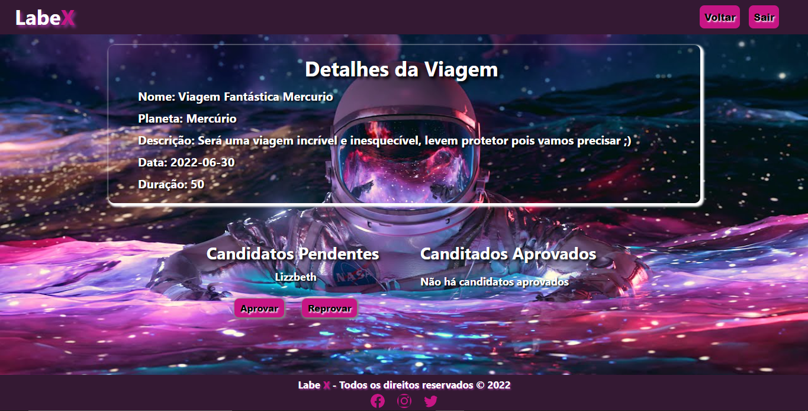   
     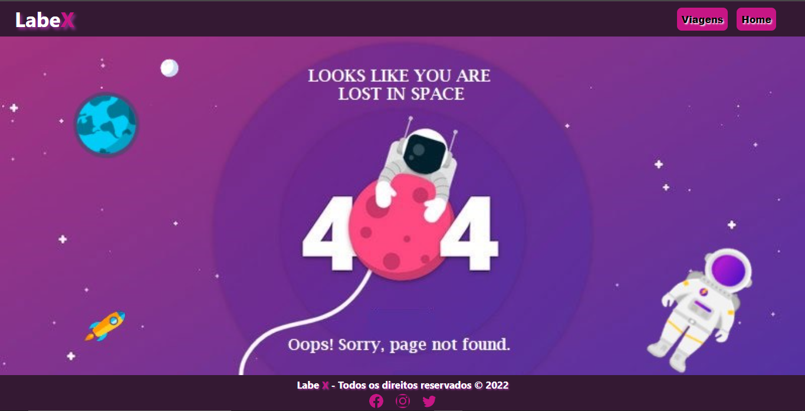   

## 📱 Mobile

     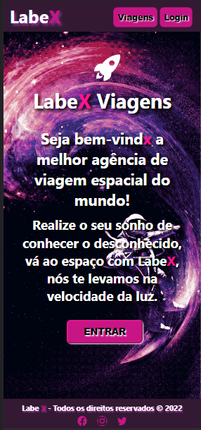  
     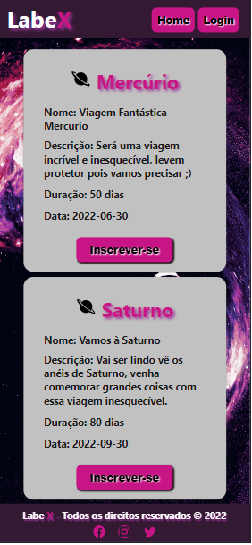  

     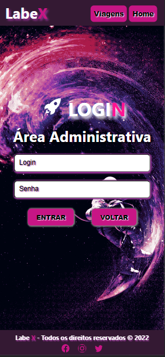 
     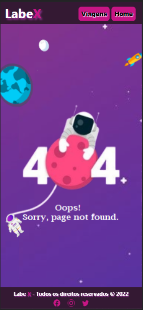  

---

<h1>
     
    
🛠️ Tecnologias Utilizadas

</h1>

 
 
 
  
  
  
  
 

 

<h1>
     
    
📚 Bibliotecas Utilizadas

</h1>

 
 

- npm
- styled-components
- axios
- react-router-dom
- material-UI

 

<h1>
     
    
⚙️ Requisitos

</h1>

A ideia será criar uma plataforma de gerenciamento de viagens espaciais. A plataforma terá **duas partes: uma pública e uma privada**. 😝

<aside>
⚠️ Muita atenção na descrição abaixo! Sempre que tiver dúvidas sobre o funcionamento do site, você pode referenciar esse trecho do enunciado

</aside>

Inicialmente, o usuário deve ser direcionado para uma página onde pode escolher entre dois fluxos:

- **Área Administrativa** (necessário login para acessar - é a parte **privada**)
- **Lista de Viagens** (para candidatos, sem login - é a parte **pública**)

Caso o usuário escolha ver a **Lista de Viagens**, será redirecionado à parte pública (sem login) do site. Na parte **pública** qualquer usuário deverá ser capaz de:

- Ver a lista de viagens existentes
- Ter acesso a uma página com formulário para se inscrever para uma viagem existente
- 💡 Dica

  Os endpoints que serão integrados nesse fluxo são apenas os que não possuem token de autenticação nos headers! São eles: `Get Trips` e `Apply To Trips`.

Caso o usuário escolha entrar na Área Administrativa, deverá ser redirecionado para uma página onde pode fazer login. Após fazer o login com uma conta válida, terá acesso à parte privada, onde deverá ser capaz de:

- Ver a lista de todas as viagens com a possibilidade de deletá-las
- Ter acesso a uma página com formulário para criar novas viagens
- Ver os detalhes de uma viagem e, dentro desta página:

  - Conseguir ver a lista de candidatos que se aplicaram para essa viagem e ainda estão pendentes
  - Aprovar ou reprovar os candidatos para a viagem
  - Ver lista atualizada de candidatos aprovados

 

<h1>
     
    
✨ O que funciona

</h1>

- Feito as rotas do site.
- Quando usuário faz login é guardado no localStorage o token.
- Pagina de detalhes do administrador.
- Usuário só consegue acessar área ADM logado.
- É possível se inscrever nas viagens.
- Pessoa com admin consegue excluir as viagens.
- Pessoa com admin consegue criar novas viagens.
- Pessoa com admin consegue aprovar ou reprovar candidato nas viagens.

<h1>
     
    
	❌ O que não funciona

</h1>

- No responsivo quando lista as Viagens para a pesssoa se inscrerver eu não consegui fazer rolar a página para mostrar todas as viagnes.

<h1>
     
    
👋 Saudações, Eli!

</h1>

_Caso queira contribuir com meu projeto, será totalmente bem-vindx!!!_

_Qualquer dúvida ou sugestão, chama no contatinho!_

 

 

### Feito com 💕 e muita dedicação
